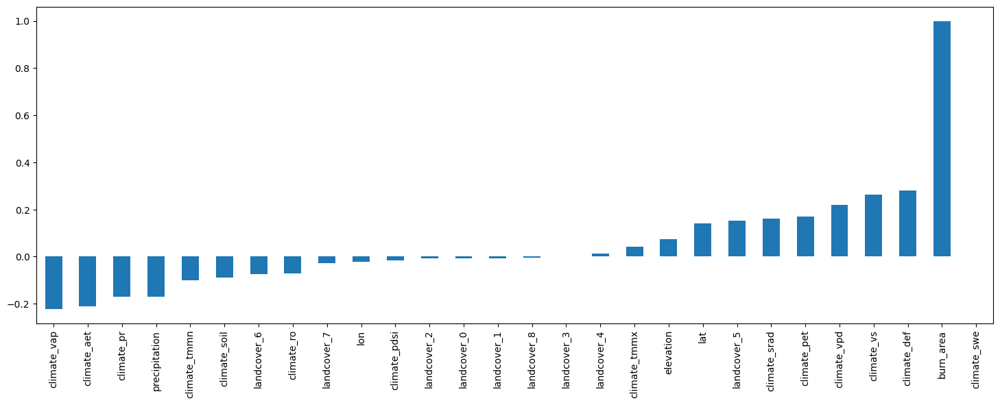

# 🔥 Burnt-Area Prediction in Zimbabwe

An exploratory regression notebook comparing linear models, trees, ensembles and lag-based features for burnt-area prediction. **By Joana Owusu-Appiah.**

## Explore

📓 [Open the notebook](new_fire_fighting_notebook.ipynb) · 📖 [Workflow and data guide](docs/workflow.md)

## Setup

```bash
git clone https://github.com/Joana-Mansa/zindi_burnt_area_challenge.git
cd zindi_burnt_area_challenge
python -m venv .venv
source .venv/bin/activate
python -m pip install -r requirements.txt
jupyter lab new_fire_fighting_notebook.ipynb
```

## Data

The original challenge inputs are `Train.csv`, `Test.csv`, `variable_definitions.csv` and `SampleSubmission.csv`. Obtain them from the original competition source; no unverified replacement dataset is supplied. Set `BURNT_AREA_DATA_DIR` to their directory.

## Results and scope

The notebook is an experiment log, not one finalized forecasting pipeline. It includes target-derived lags together with random splits. Those results need a time/group-aware validation review before being used as forecast evidence. Never construct holdout features from unavailable future targets. Published historical outputs are retained, not presented as a new benchmark.



This preview was exported from the original notebook’s saved output.
